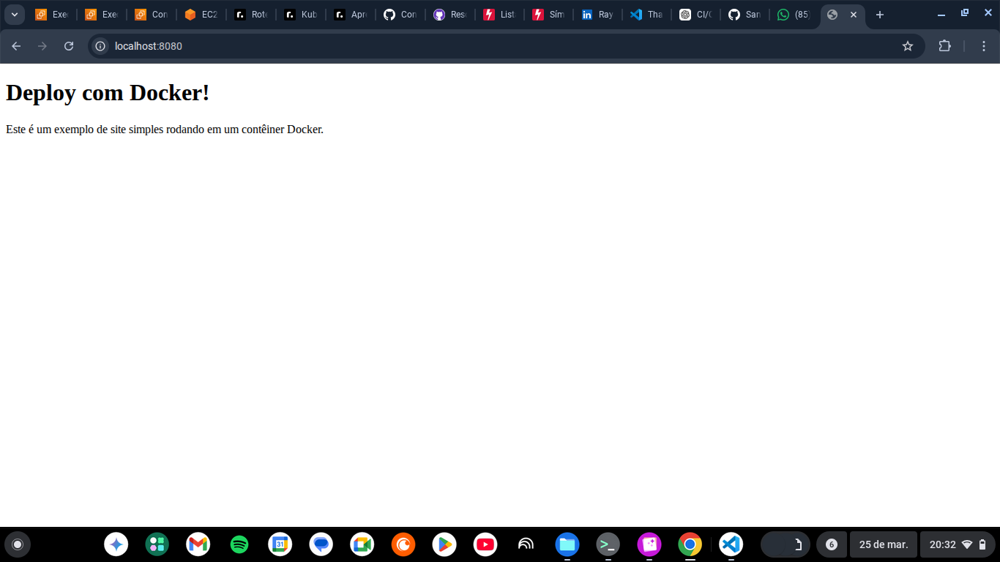
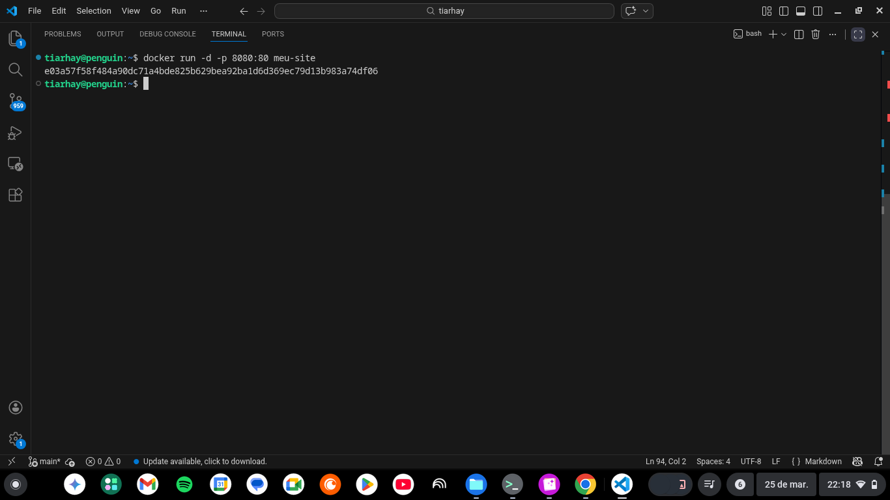
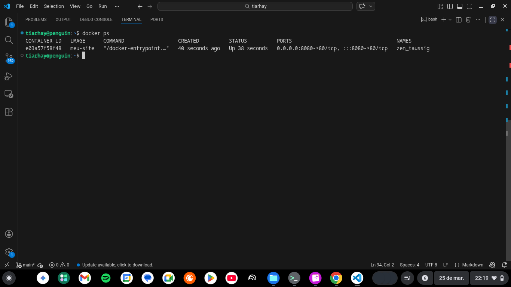

# 🚀 Projeto: Site HTML + Docker


>Este projeto demonstra como empacotar um site estático (HTML + CSS) em um container Docker utilizando Nginx.


--- 

## 📌 Objetivo 

Praticar conceitos fundamentais de containerização, incluido: 

- Criação de Dockerfile
- Build de imagens Docker
- Execução de containers
- Exposição de portas
- Servir aplicação com Nginx

---

## Estutura do Projeto

```bash
meu-site-docker/ 
├── index.html 
├── style.css 
├── Dockerfile 
└── README.md
```
---

## 🛠️ Tecnologias Utilizadas

- HTML
- CSS
- Docker
- Nginx

---

## 📂 Arquivos principais

-[index.html](./index.html)

-[style.css](./style.css)

-[Dockerfile](./Dockerfile)

----

### ⚙️ Como executar

### 1. Inicializando o repositório e enviado para o GitHub

```bash
git init
git add .
git commit -m "feat: adicionando estrutura ao projeto"
git remote add origin https://github.com/SantRhay/meu-site-docker
git push -u origin main
```

### 2. 🐳 Build Da imagem Docker

```bash
docker build -t meu site .
```

### 3. ▶️ Execução do container
```bash
docker run -d -p 8080:80 meu-site
```
### 4. 🌐 Acesso

http:localhost:8080

### 5. 🐳 Validação da execução
O projeto foi validado com execução local do container: 
```bash
docker ps
```

---

### 📸 Execução da aplicação

Aplicação rodando em container Docker:


---

### 🐳 Execução do Container

Container em execução via Docker:


---

### 📊 Containers ativos
Verificação do container em execução:


----

#### 🧪 Testes realizados

- Build da imagem Docker
- Execução do container
- Acesso via navegador

---

## Melhorias futuras

- CI/CD com GitHub Actions
- Deploy automático na AWS
- Docker Compose
- HTTPS com domínio
---
## 💼 Contexto profissional
Este projeto foi desenvolvido com foco em práticas de DevOps, incluindo:

- Versionamento com Git
- Uso de containers com Docker
- Estrutura de projeto organizada
- Documentação clara

---

## 👩‍💻 Autora

**Rayane Santana**

## ⭐ Conclusão

>Projeto criado para consolidar conhecimentos em containerização e preparação de aplicações para ambientes reais de deploy.